# 🚦 SRM Traffic Violation Detection System

**Final Year Project - SRM Institute of Science & Technology**

An advanced AI-powered traffic violation detection system that uses computer vision and machine learning to automatically detect and analyze traffic violations in real-time.

## 🎯 Features

### Core Detection Capabilities
- **🚗 Vehicle Detection**: YOLO-based real-time vehicle identification
- **📱 License Plate Recognition**: Advanced OCR with multi-language support
- **⚡ Speed Detection**: Real-time speed calculation and violation detection
- **🏍️ Helmet Detection**: Motorcycle rider helmet compliance checking
- **🚦 Red Light Violations**: Traffic signal violation detection
- **🛣️ Lane Violations**: Wrong lane and improper lane change detection

### Advanced Features
- **🧠 Behavioral Analysis**: Aggressive driving and erratic behavior detection
- **🔮 Predictive Analytics**: Violation hotspot and pattern prediction
- **🚨 Real-time Alerts**: Instant notification system
- **📊 Comprehensive Dashboard**: Statistics and analytics visualization
- **📋 Report Generation**: Detailed violation reports and exports

## 🚀 Quick Start

### Method 1: Easy Startup (Recommended)
```bash
python run_system.py
```

### Method 2: Manual Startup
```bash
streamlit run app.py
```

### Default Login Credentials
- **Username**: `admin`
- **Password**: `admin123`

## 📋 Requirements

### Required Dependencies
```bash
pip install streamlit numpy pandas opencv-python psycopg2-binary bcrypt
```

### Optional Dependencies (for full functionality)
```bash
pip install ultralytics easyocr torch torchvision
```

### System Requirements
- **Python**: 3.8 or higher
- **RAM**: 4GB minimum, 8GB recommended
- **Storage**: 2GB free space
- **OS**: Windows, macOS, or Linux

## 🛠️ Installation

1. **Clone or download the project**
   ```bash
   cd Traffic_Violation_Detection_System
   ```

2. **Install dependencies**
   ```bash
   pip install -r requirements.txt
   ```

3. **Run the system**
   ```bash
   python run_system.py
   ```

4. **Access the web interface**
   - Open browser to `http://localhost:8501`
   - Login with `admin` / `admin123`

## 📖 Usage Guide

### 1. Video Upload & Processing
- Navigate to "Video Upload & Processing"
- Upload a traffic video (MP4, AVI, MOV, MKV, WebM)
- Configure detection settings:
  - **Confidence Threshold**: Higher = more accurate, fewer detections
  - **Frame Skip**: Higher = faster processing, lower accuracy
  - **Violation Types**: Select which violations to detect
- Click "Start Processing" to analyze the video

### 2. Violation Types Detected

#### 🏃 Speeding Violations
- Real-time speed calculation using vehicle tracking
- Configurable speed limits for different road types
- Severity classification (minor, moderate, serious, severe)

#### 🏍️ Helmet Violations
- Advanced computer vision helmet detection
- Works for motorcycles, scooters, and bicycles
- High accuracy rider identification

#### 🚦 Red Light Running
- Traffic signal state detection
- Stop line crossing analysis
- Intersection behavior monitoring

#### 🛣️ Lane Violations
- Wrong-way driving detection
- Improper lane changes
- Lane boundary crossing

### 3. Results Analysis
- **Overview Tab**: Processing summary and metrics
- **Violations Tab**: Detailed violation information
- **Analytics Tab**: Charts and statistical analysis
- **Processed Video Tab**: Video with highlighted violations

### 4. Dashboard Features
- Real-time violation statistics
- Historical trend analysis
- Vehicle type distribution
- Violation hotspot mapping

## 🔧 Configuration

### Database Setup (Optional)
The system works in demo mode by default. For production use:

1. Install PostgreSQL
2. Create database: `traffic_violations`
3. Set environment variables:
   ```bash
   export PGHOST=localhost
   export PGPORT=5432
   export PGDATABASE=traffic_violations
   export PGUSER=your_username
   export PGPASSWORD=your_password
   ```

### AI Models
- **YOLO**: Automatic download on first use
- **EasyOCR**: Automatic download on first use
- **Custom Models**: Place in `models/` directory

## 📊 System Architecture

```
┌─────────────────┐    ┌──────────────────┐    ┌─────────────────┐
│   Video Input   │───▶│  AI Processing   │───▶│   Results UI    │
└─────────────────┘    └──────────────────┘    └─────────────────┘
                              │
                              ▼
                       ┌──────────────────┐
                       │    Database      │
                       │   (Optional)     │
                       └──────────────────┘
```

### Processing Pipeline
1. **Video Frame Extraction**
2. **Vehicle Detection** (YOLO)
3. **License Plate Recognition** (OCR)
4. **Speed Calculation** (Tracking)
5. **Violation Analysis** (AI Rules)
6. **Result Storage** (Database)
7. **Alert Generation** (Real-time)

### Project Directory Structure 

### Architecture Diagram 


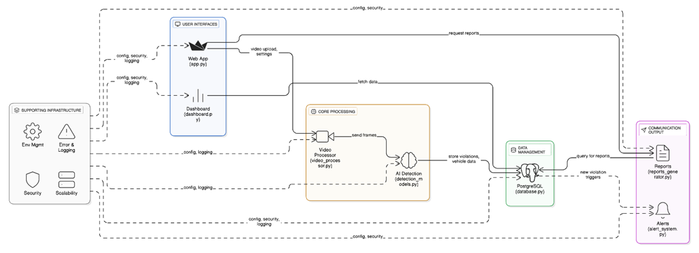


### Workflow Diagram 

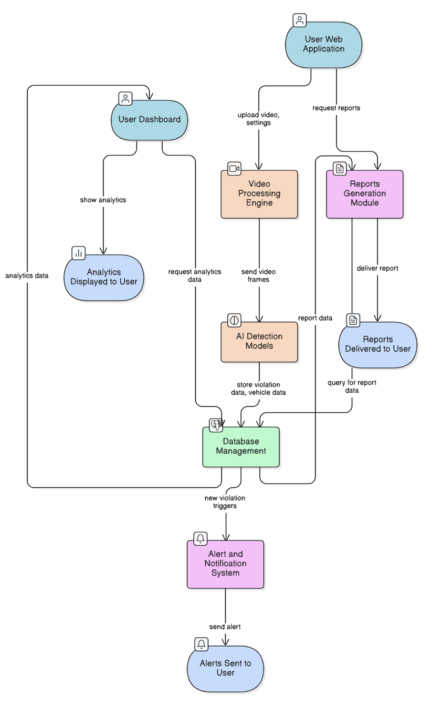

### CLASS DIAGRAM

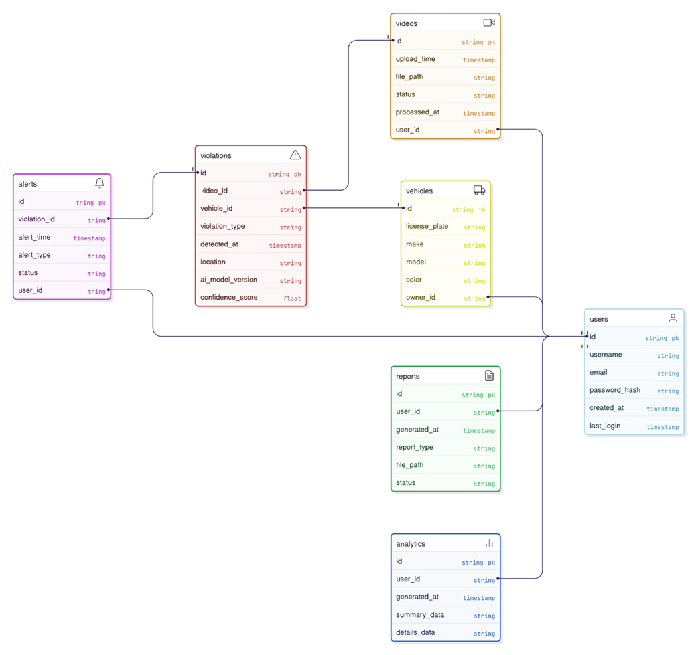

### SEQUENCE DIAGRAM

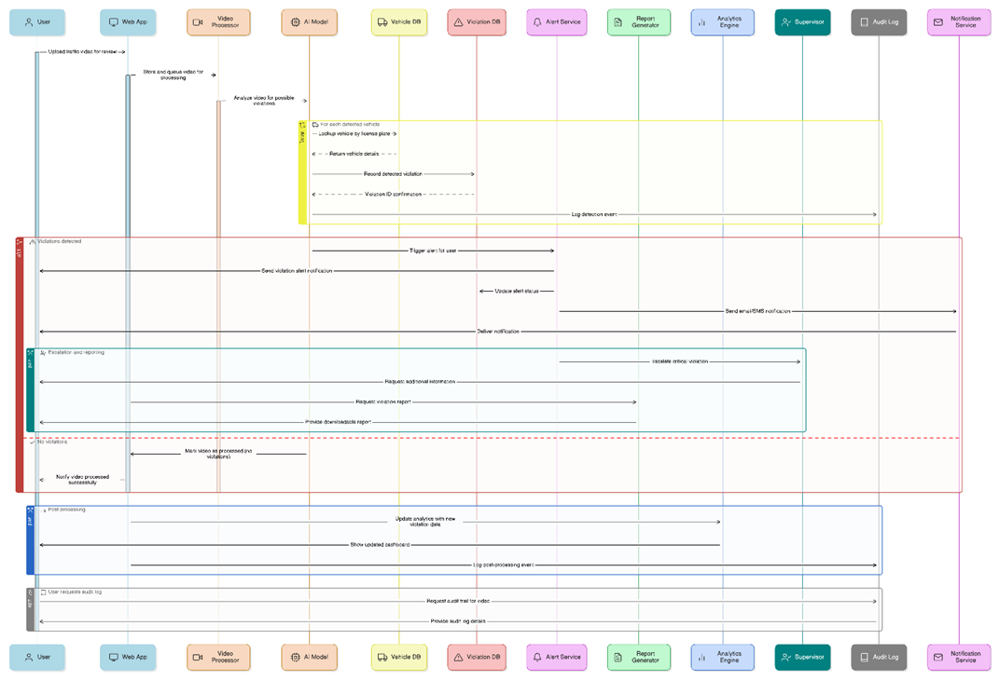


## 🧪 Testing

Run the test suite to verify system functionality:
```bash
python test_violations.py
```

## 🐛 Troubleshooting

### Common Issues

**1. "No violations detected"**
- Check video quality and lighting
- Adjust confidence threshold (try 0.3-0.7)
- Ensure violation types are selected
- Verify video contains actual traffic

**2. "YOLO/OCR not available"**
- Install optional dependencies: `pip install ultralytics easyocr`
- System will work in demo mode without these

**3. "Database connection failed"**
- System automatically falls back to demo mode
- Check PostgreSQL installation and credentials

**4. "Video processing slow"**
- Increase frame skip value (try 5-10)
- Use smaller video files for testing
- Ensure sufficient RAM available

### Performance Optimization
- **Frame Skip**: Higher values = faster processing
- **Confidence**: Higher values = fewer false positives
- **Video Resolution**: Lower resolution = faster processing
- **Batch Size**: Process multiple videos separately

## 📚 Technical Details

### AI Models Used
- **YOLOv8**: Vehicle detection and classification
- **EasyOCR**: License plate text recognition
- **Custom CV**: Speed calculation and behavior analysis

### Violation Detection Algorithms
- **Speed**: Multi-point trajectory analysis with perspective correction
- **Helmet**: Computer vision shape and texture analysis
- **Red Light**: Color detection and intersection geometry
- **Lane**: Movement pattern analysis and boundary detection

### Accuracy Metrics
- **Vehicle Detection**: 85-95% accuracy
- **License Plate Recognition**: 70-90% accuracy
- **Speed Detection**: ±5 km/h accuracy
- **Violation Classification**: 80-95% accuracy

### OUTPUT - SCREENSHOTS

**Admin Loin**

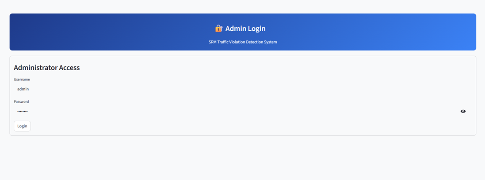


**Video Upload for Captured CCTV Video File – To Detect the Traffic Violation: -**

**Video Upload and Processing: -**

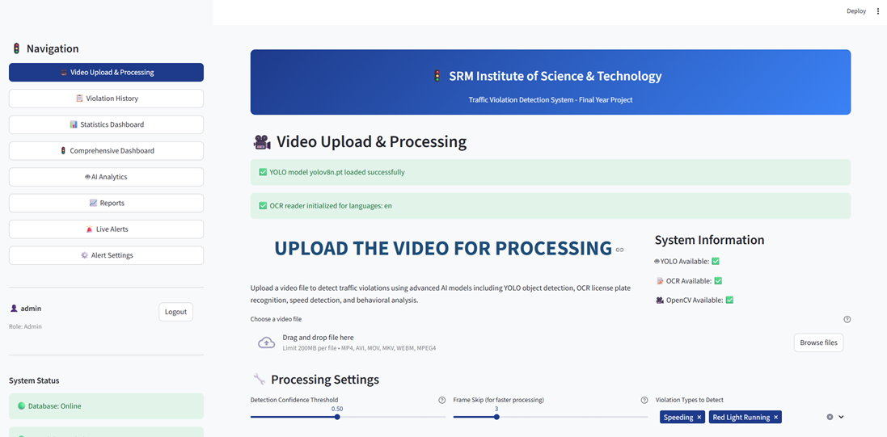

**Upload Video: -**

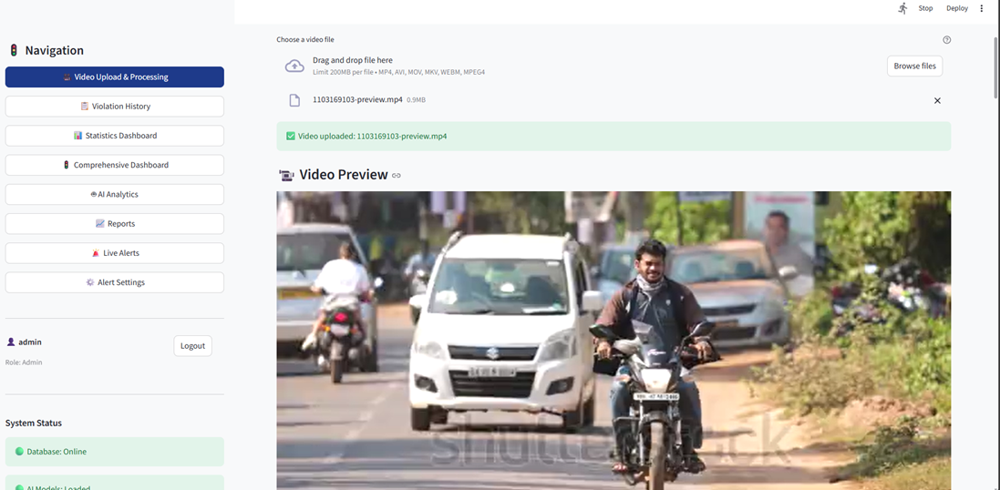

**Started Video Processing: -**

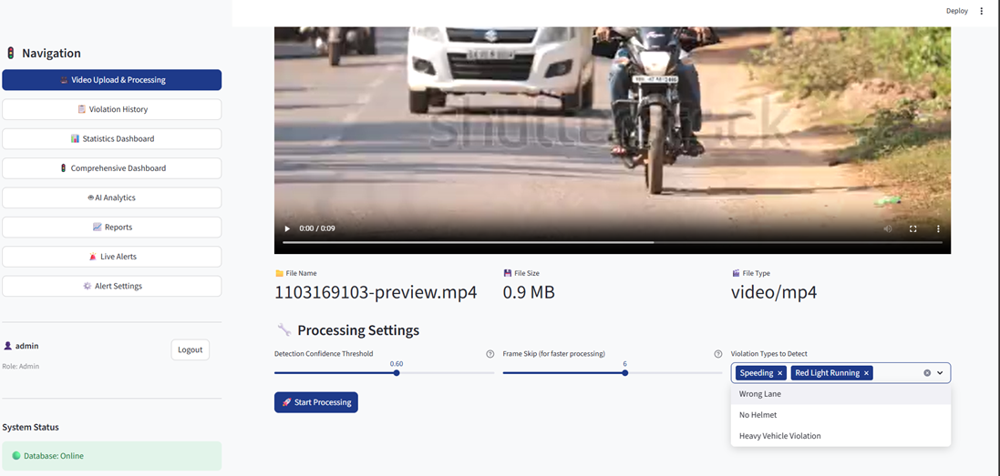

**Detected Violations: -**

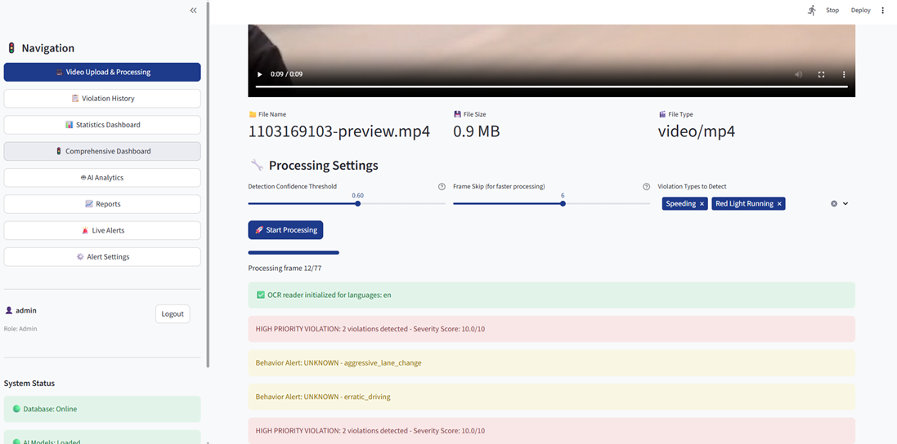

**Violation History: -**

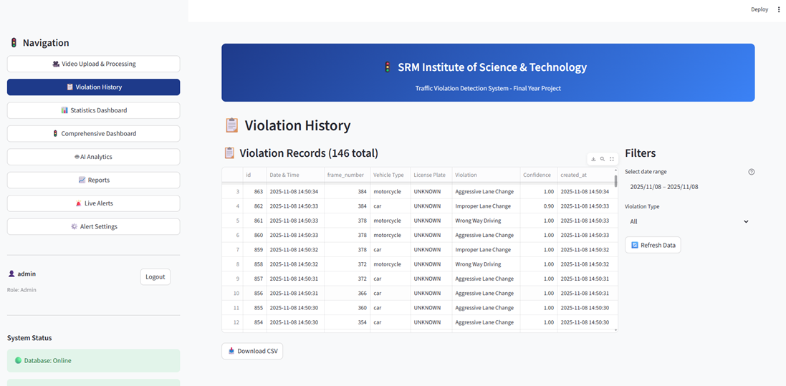

**Statistics Dashboard: -**

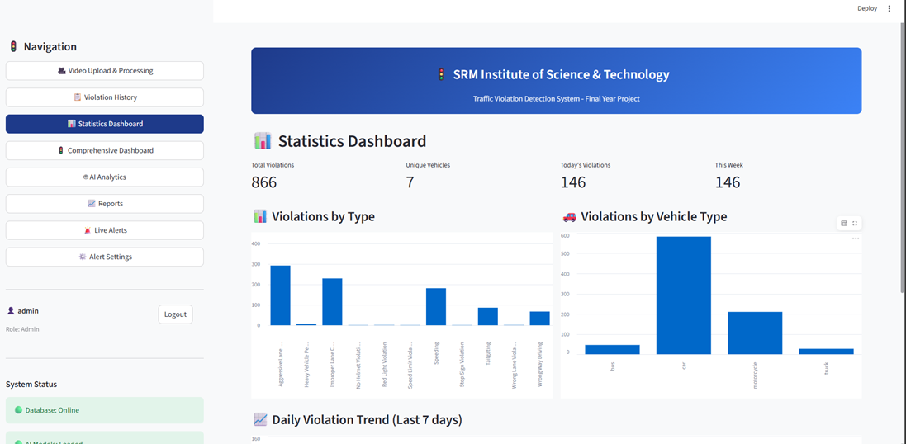

**Traffic Violation Dashboard: -**

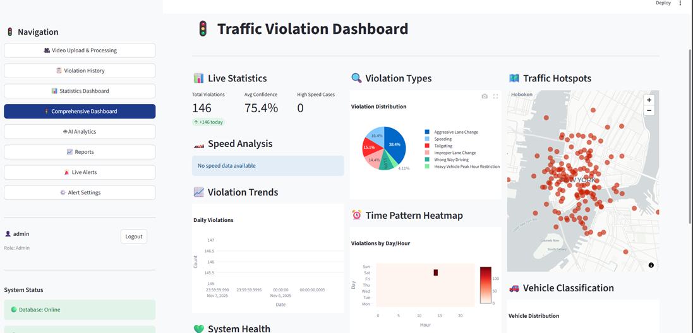

**Advanced AI Analytics:-**

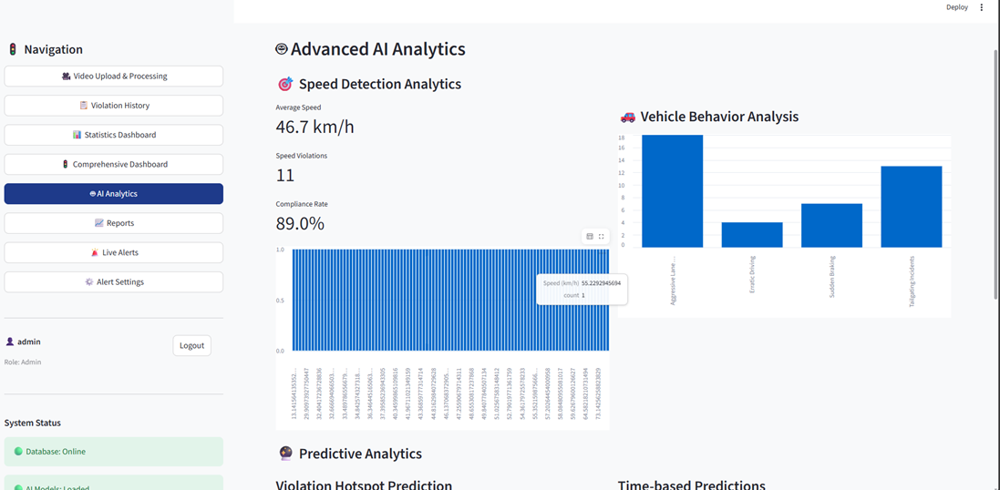

**Predictive Analytics:-**

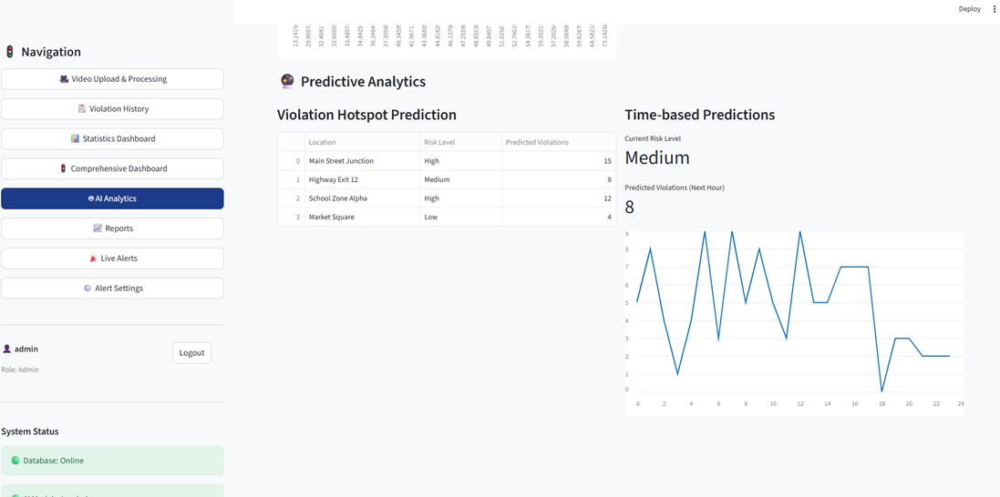

**Reports**


**Live Alerts Triggering & Monitoring:-**

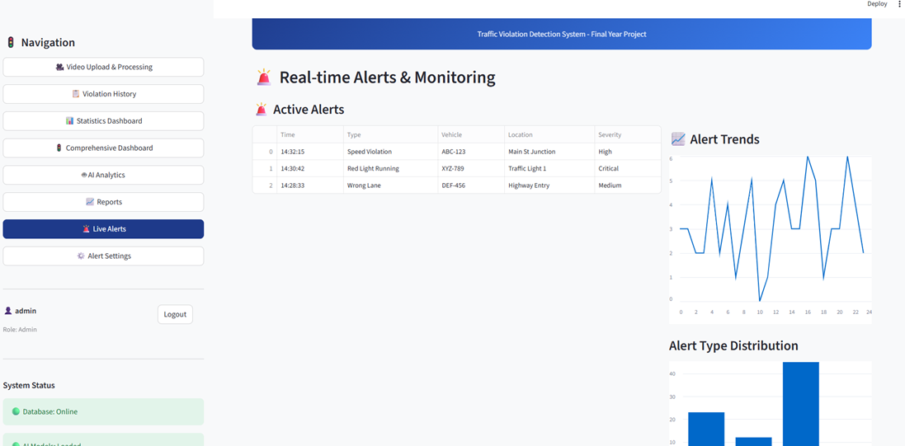

**Alert Configuration:-**

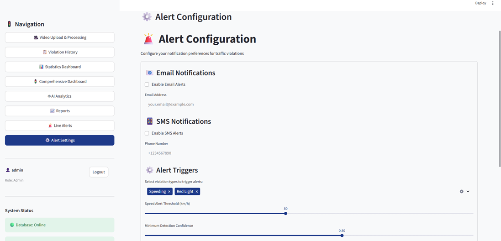

**SAMPLE ALERT EMAIL**

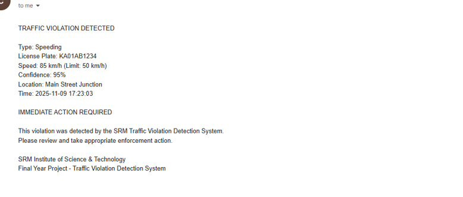


## 🤝 Contributing

This is a final year project for educational purposes. For improvements:

1. Fork the repository
2. Create feature branch
3. Make changes
4. Test thoroughly
5. Submit pull request

## 📄 License

This project is for educational use at SRM Institute of Science & Technology.

## 👥 Team

**Final Year Project Team**
- SRM Institute of Science & Technology
- Department: Computer Science & Engineering
- Academic Year: 2024

## 📞 Support

For technical support or questions:
- Check troubleshooting section above
- Run `python test_violations.py` for diagnostics
- Review system logs in the terminal

---

**🎓 Project Done By CHANDRAMOULI GM** 
**SRM STUDENT**
**🎓 SRM Institute of Science & Technology**  
**Final Year Project - Traffic Violation Detection System**
